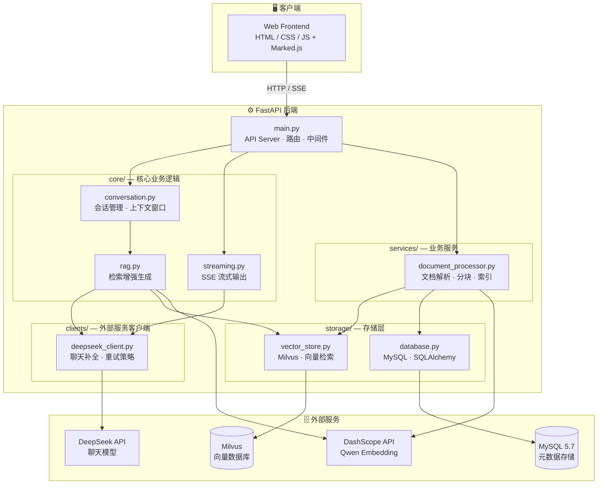
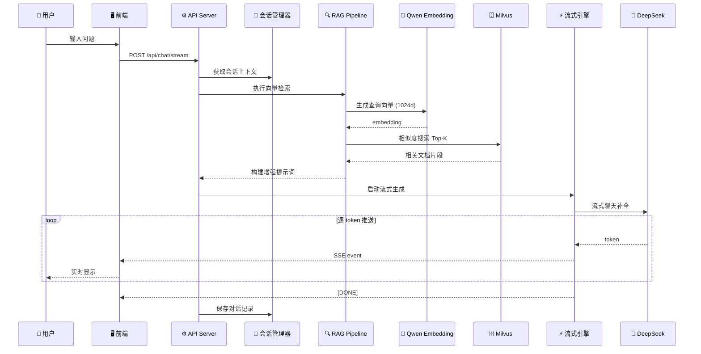
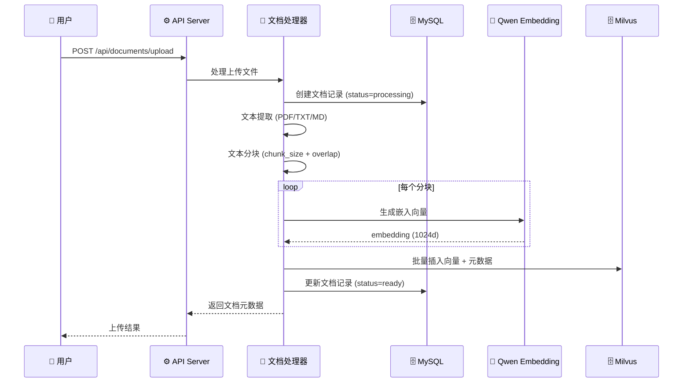
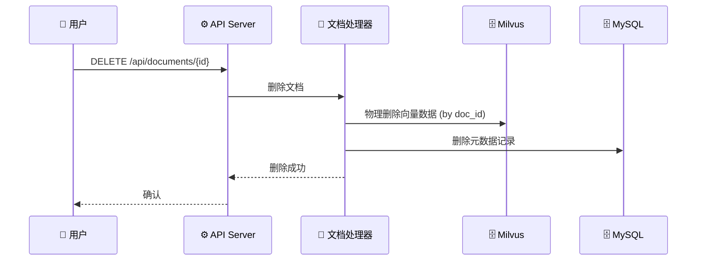
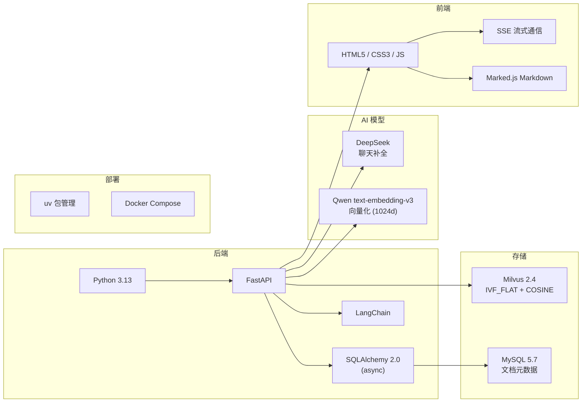

<p align="center">
  
  
  
  
  
  
  
  
</p>

# 🤖 Enterprise AI Assistant

> 基于 RAG（检索增强生成）的企业级智能对话助手，支持多轮对话、流式输出、知识库管理。

---

## ✨ 功能特性

| 特性 | 描述 |
|------|------|
| 🔄 多轮对话 | 支持上下文记忆，最近 20 轮对话窗口 |
| ⚡ 流式输出 | 基于 SSE 协议，逐 token 实时推送 |
| 📚 RAG 检索增强 | 向量相似度检索 + LLM 生成，回答有据可查 |
| 📄 文档管理 | 支持 PDF / TXT / Markdown 上传、索引、删除 |
| 🗄️ 元数据持久化 | 文档元数据存储到 MySQL，重启不丢失 |
| 🎨 现代化 UI | 简约大气，深色/浅色主题，知识库管理面板 |
| 🐳 Docker 部署 | 一键 docker compose 启动 |

---

## 🏗️ 系统架构



---

## 🔄 核心流程

### 对话流程



### 文档上传流程



### 文档删除流程



---

## 🧩 项目结构与模块说明

```
├── app/
│   ├── __init__.py
│   ├── main.py                        # FastAPI 应用入口，路由注册，生命周期管理
│   ├── config.py                      # 配置管理 (pydantic-settings)
│   ├── models.py                      # Pydantic 数据模型
│   │
│   ├── core/                          # 🧠 核心业务逻辑
│   │   ├── conversation.py            #    会话管理，上下文窗口，历史记录
│   │   ├── rag.py                     #    RAG 管线，向量检索 + 提示词构建
│   │   └── streaming.py               #    SSE 流式引擎，token 实时推送
│   │
│   ├── clients/                       # 🌐 外部服务客户端
│   │   └── deepseek_client.py         #    DeepSeek API 封装，聊天补全，指数退避重试
│   │
│   ├── storage/                       # 🗄️ 存储层
│   │   ├── database.py                #    MySQL 连接，SQLAlchemy ORM，文档表定义
│   │   └── vector_store.py            #    Milvus 向量存储，CRUD + 相似度搜索
│   │
│   └── services/                      # ⚙️ 业务服务
│       └── document_processor.py      #    文档上传/解析/分块/向量化/索引/删除
│
├── static/                            # 🎨 前端资源
│   ├── index.html                     #    主页面 (知识库管理面板)
│   ├── css/style.css                  #    UI 样式 (深色/浅色主题)
│   └── js/app.js                      #    交互逻辑 (SSE、会话、上传、知识库管理)
│
├── tests/                             # 🧪 测试
│   └── test_deepseek_client.py        #    DeepSeek 客户端单元测试
│
├── .env.example                       # 环境变量模板
├── Dockerfile                         # Docker 镜像构建
├── docker-compose.yml                 # 编排 (App + Milvus)
├── pyproject.toml                     # 项目依赖 (uv)
└── README.md
```

### 分层架构

| 层级 | 目录 | 职责 | 依赖方向 |
|------|------|------|----------|
| API 层 | `main.py` | 路由、请求校验、错误处理、静态文件 | → core, services |
| 核心层 | `core/` | 对话管理、RAG 检索、流式输出 | → clients, storage |
| 服务层 | `services/` | 文档处理全流程（解析→分块→向量化→索引） | → clients, storage |
| 客户端层 | `clients/` | 外部 API 调用封装（DeepSeek） | → 外部服务 |
| 存储层 | `storage/` | 数据持久化（MySQL 元数据 + Milvus 向量） | → 外部存储 |
| 配置层 | `config.py` | 环境变量加载、校验 | 被所有层引用 |
| 模型层 | `models.py` | 数据结构定义 | 被所有层引用 |

### 模块详细说明

| 模块 | 文件 | 核心类/函数 | 说明 |
|------|------|-------------|------|
| 配置 | `config.py` | `Settings`, `validate_settings()` | pydantic-settings，从 `.env` 加载，启动时校验必填项 |
| 数据模型 | `models.py` | `Message`, `Session`, `DocumentMetadata`... | 所有请求/响应/内部数据结构 |
| 对话管理 | `core/conversation.py` | `ConversationManager` | 内存会话存储，20 轮上下文窗口，自动截断 |
| RAG 管线 | `core/rag.py` | `RAGPipeline` | 查询向量化 → Milvus Top-K → 阈值过滤 → 提示词注入 |
| 流式引擎 | `core/streaming.py` | `StreamingEngine` | DeepSeek 流式响应 → SSE 事件格式封装 |
| DeepSeek | `clients/deepseek_client.py` | `DeepSeekClient` | 聊天补全(流式/非流式)，Qwen embedding，3次指数退避重试 |
| MySQL | `storage/database.py` | `DocumentRecord`, `init_db()` | 异步 SQLAlchemy + aiomysql，文档元数据 CRUD |
| Milvus | `storage/vector_store.py` | `MilvusVectorStore` | 集合管理、向量插入、余弦相似度搜索、物理删除 |
| 文档处理 | `services/document_processor.py` | `DocumentProcessor` | PDF/TXT/MD 提取 → 分块 → embedding → Milvus 索引 → MySQL 记录 |

---

## 🛠️ 技术栈



---

## 🚀 快速开始

### 前置条件

- Python 3.13+
- [uv](https://docs.astral.sh/uv/) 包管理器
- MySQL 5.7 实例
- Milvus 实例（本地 Docker 或远程）
- DeepSeek API Key
- 阿里云 DashScope API Key（Qwen Embedding）

### 1. 克隆 & 安装

```bash
git clone <repo-url>
cd business_agent_rag
uv sync
```

### 2. 配置环境变量

```bash
cp .env.example .env
```

编辑 `.env`：

```env
# 必填
DEEPSEEK_API_KEY=sk-xxx
EMBEDDING_API_KEY=sk-xxx

# MySQL
MYSQL_HOST=your-mysql-host
MYSQL_PORT=3306
MYSQL_USER=root
MYSQL_PASSWORD=your-password
MYSQL_DATABASE=ai_assistant
```

### 3. 准备 MySQL

```sql
CREATE DATABASE ai_assistant CHARACTER SET utf8mb4 COLLATE utf8mb4_general_ci;
```

应用启动时会自动建表。

### 4. 启动 Milvus

```bash
docker run -d --name milvus-standalone \
  -p 19530:19530 -p 9091:9091 \
  -e ETCD_USE_EMBED=true \
  -e COMMON_STORAGETYPE=local \
  milvusdb/milvus:v2.4-latest
```

### 5. 运行

```bash
uv run uvicorn app.main:app --reload --host 0.0.0.0 --port 8000
```

访问 **http://localhost:8000** 🎉

---

## 🐳 Docker 部署

```bash
cp .env.example .env
# 编辑 .env

docker compose up -d
```

---

## 📡 API 端点

| 方法 | 路径 | 描述 |
|------|------|------|
| `POST` | `/api/sessions` | 创建新会话 |
| `GET` | `/api/sessions/{id}/history` | 查询会话历史 |
| `POST` | `/api/chat` | 非流式对话 |
| `POST` | `/api/chat/stream` | 流式对话 (SSE) |
| `POST` | `/api/documents/upload` | 上传文档 (PDF/TXT/MD) |
| `GET` | `/api/documents` | 文档列表 |
| `GET` | `/api/documents/{id}` | 文档详情 |
| `DELETE` | `/api/documents/{id}` | 删除文档 (物理删除向量+元数据) |
| `GET` | `/api/knowledge-base/stats` | 知识库统计 |

---

## ⚙️ 配置项

| 变量 | 必填 | 默认值 | 说明 |
|------|:----:|--------|------|
| `DEEPSEEK_API_KEY` | ✅ | — | DeepSeek 聊天模型密钥 |
| `EMBEDDING_API_KEY` | ✅ | — | 阿里云 DashScope 密钥 |
| `MYSQL_HOST` | ✅ | `localhost` | MySQL 地址 |
| `MYSQL_PORT` | | `3306` | MySQL 端口 |
| `MYSQL_USER` | | `root` | MySQL 用户名 |
| `MYSQL_PASSWORD` | ✅ | — | MySQL 密码 |
| `MYSQL_DATABASE` | | `ai_assistant` | 数据库名 |
| `MILVUS_URI` | | `http://localhost:19530` | Milvus 地址 |
| `RAG_TOP_K` | | `5` | 向量检索返回数量 |
| `RAG_SIMILARITY_THRESHOLD` | | `0.5` | 相似度过滤阈值 |
| `CHUNK_SIZE` | | `500` | 文本分块大小 |
| `CHUNK_OVERLAP` | | `50` | 分块重叠大小 |
| `MAX_CONTEXT_TURNS` | | `20` | 对话上下文窗口轮数 |

---

## 📄 License

MIT
